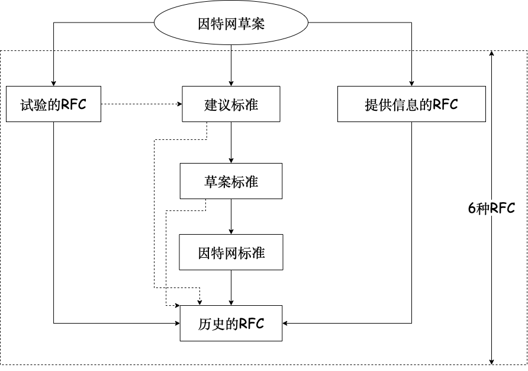

# 1.1 计算机网络概述

## 1.1.1 计算机网络的概念

## 1.1.2 计算机网络的组成

硬件、软件和协议

资源子网：上三层

通信子网：下三层
## 1.1.5 计算机网络的标准化工作

## 1.1.6 计算机网络的性能指标

带宽：最高数据传输速率

吞吐量：单位时间内通过某个网络的数据量

传输时延=分组长度/信道带宽

传播时延=信道长度/电磁波在信道上的传播速率

传输时延>>传播时延

时延带宽积=传播时延 x 信道带宽

往返时延 RTT=2*传播时延

信道利用率=有数据通过的时间/（有 + 无）数据通过的时间
<Vssue :title="comment" />