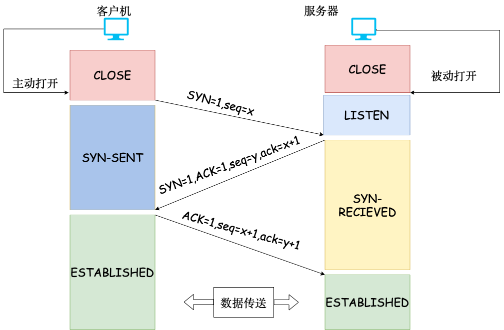
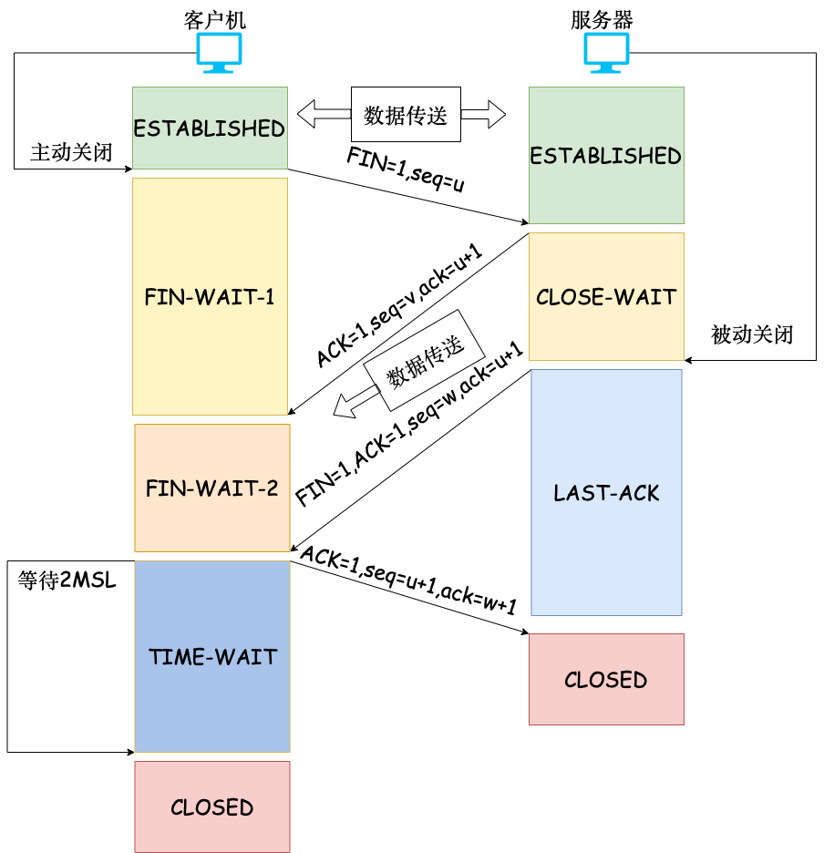

# 5.3 TCP 协议

## 5.3.2 TCP 报文段

TCP 首部最短 20B

确认位 ACK=1 表示正确收到

确认号 N：到序号 N-1 为止的数据都已经正确收到，期望收到的第一个字节的序号 N

序号：本报文段发送的第一个字节的序号

同步位 SYN

SYN=1，ACK=0，连接请求报文

SYN=1，ACK=1，连接接受报文

## 5.3.3 TCP 连接管理

TCP 是端到端通信

TCP 连接的端点是套接字

一条连接使用它们的套接字表示 (1,x)-(2,y) 是两个端口唯一的连接，后建立的连接会被阻止。

### 1.TCP 连接建立（三次握手）

SYN=1，seq=x(随机)

SYN=1,ACK=1,seq=y(随机),ack=x+1

ACK=1,seq=x+1,ack=y+1

我能和你说句话吗？

可以

好的

SYN 洪泛攻击：

一直发送 SYN，不回复，导致服务器一直发送 ACK，占用资源直到服务器死机。

::: tip 为什么不采用“两次握手”建立连接？
为了防止两次握手情况下已失效的连接请求报文突然又传送到服务器而产生错误。
:::

### 2.TCP 连接释放（四次握手）

FIN=1,seq=u

ACK=1,seq=v,ack=u+1(半关闭状态，客户到服务器方向的连接释放)

FIN=1,ACK=1,seq=w,ack=u+1(FIN 表示单方面释放连接，表示本方已经无数据发送，但可以接收对方数据）

ACK=1,seq=u+1,ack=w+1

A（客户机）：我说完了

B（服务器）：好的，我想说。。。。

B：我说完了

A：好的

A 说完话后，TCP 状态变为 TIME_WAIT，此时 TCP 连接还没有释放，还要等 2MSL（2 个最长报文段寿命），客户机才进入 CLOSED（连接关闭）状态。

::: tip 为什么不采用“三次握手”释放连接？
为了防止三次握手情况下已失效的连接请求报文突然又传送到服务器而产生错误。
:::

::: tip 为什么发送最后一次握手报文后要等待 2MSL 时间？
为了防止最后的确认报文段能够到达 B。如果最后的确认报文段未到达 B，而且 A 关闭的话，B 就无法关闭。
:::

参考资料：[RFC793](https://www.rfc-editor.org/rfc/inline-errata/rfc793.html)

## 5.3.4 TCP 可靠传输

### 1.序号

### 2.确认

### 3.重传

#### （1）超时重传

#### （2）冗余 ACK

## 5.3.5 TCP 流量控制

接受窗口：接收方根据自己接收缓存的大小，动态地调整发送方的发送窗口大小。

## 5.3.6 TCP 拥塞控制

拥塞窗口 cwnd：发送方根据自己估算的网络拥塞程度而设置的窗口值。

发送窗口上限：min[接受窗口，拥塞窗口]

### 1.慢开始

拥塞窗口=1，2，4，8，……

发送方开始只发送一个报文段，目的是试探一下网络的拥塞情况。

### 2.拥塞避免

拥塞窗口+=1

慢开始门限 ssthresh 是前一次拥塞的一半

cwnd<ssthresh:慢开始

cwnd>ssthresh:拥塞避免

网络拥塞后:ssthresh=cwnd/2,cwnd=1

注意⚠️：慢开始不能越过 ssthresh

### 3.快重传

发送方收到三个连续的 ACK 报文后，直接重传对方未收到的报文段

### 4.快恢复

网络拥塞后:ssthresh=cwnd/2,cwnd=ssthresh，然后拥塞避免

就是跳过了慢开始

TCP 连接建立和网络出现超时时：慢开始和拥塞避免

发送方收到冗余 ACK 时，采用快重传和快恢复

参考资料：[RFC5681](https://www.rfc-editor.org/rfc/inline-errata/rfc5681.html)