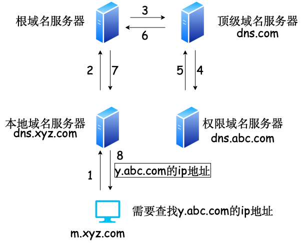
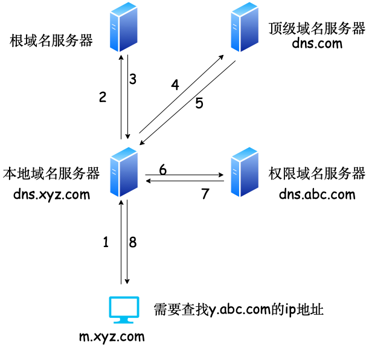

# 6.2 域名系统
## 6.2.1 层次域名空间
作用：把便于人们记忆的主机名（www.baidu.com）转换为便于机器处理的IP地址。DNS系统采用客户/服务器模型，其协议运行于UDP上，使用53号端口。

www.baidu.com

三级域名.二级域名.顶级域名

域名就是一棵树🌲
## 6.2.2 域名服务器
根域名服务器

顶级域名服务器

权限域名服务器

本地域名服务器
## 6.2.3 域名解析过程
域名-->IP地址   称为正向解析

IP地址 -->域名   称为反向解析

班长：本地域名服务器

校长：根域名服务器

年级主任：顶级域名服务器 

班主任：权限域名服务器

小明：域名

学号：IP地址

笔记本📒：本地缓存

大脑🧠：高速缓存

递归查询（较少使用，因为该方法给校长压力过大）：

小明问了问班长：小明的学号是什么？

班长查了查笔记本📒说：不知道。

班长问校长：小明的学号是什么？

校长查了查学校名单说：小明是我们学校的，所以小明的学号是1XXXXX，其他的我帮你问年级主任。

校长问年级主任：小明的学号是什么？

年级主任查了查年级手册说：小明是一年级的，所以他的学号是101XXX，其他的我问一下班主任。

年级主任问班主任：小明的学号是什么？

班主任查了查班级手册说：小明是2班的，所以小明的学号是101002。

年级主任对校长说：小明的学号是101002。

校长对班长说：小明的学号是101002。

班长对小明说：小明的学号是101002。

小明的名字（域名）就转变成了学号（IP地址）

班长把小明的学号记在了笔记本📒上。

递归与迭代相结合的查询（8个UDP报文）：

1.小明问了问班长：小明的学号是什么？（递归查询）

2.班长查看笔记本📒说不知道，班长问校长：小明的学号是什么？（迭代查询）

3.校长查了查学校名单对班长说：小明是我们学校的，所以小明的学号是1XXXXX。

4.班长问年级主任：小明的学号是什么？（迭代查询）

5.年级主任查了查年级手册说：小明是一年级的，所以他的学号是101XXX。

6.班长问班主任：小明的学号是什么？（迭代查询）

7.班主任查了查班级手册，对班长说：小明是2班的，所以小明的学号是101002。

8.班长班长把小明的学号记在了笔记本📒上，并对小明说：小明的学号是101002。

小明的名字（域名）就转变成了学号（IP地址）

为了提高查找效率，每个人都将自己知道的东西记在大脑🧠（高速缓存）里，以后再有人问相同的问题就会直接告诉他答案。因为学号和姓名的对应关系不是永久的（假设如此），所以每个人将在一段时间后删除大脑🧠中的信息。

小明问班长不用发送DNS查询，其他问法要DNS查询。
