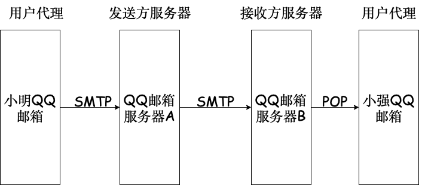

# 6.4 电子邮件

## 6.4.1 电子邮件系统的组成结构

用户代理：用户与电子邮件系统的接口：QQ 邮箱

邮件服务器：采用客户/服务器方式工作，必须能同时充当客户和服务器。

SMTP：“推”，用户代理——>服务器，服务器——>服务器

POP：“拉”，服务器——>用户代理

## 6.4.2 电子邮件格式与 MIME

### 多用途网际邮箱扩充 (MIME)

中文等非 ASCII 码传输

## 6.4.3 SMTP 和 POP3

用户代理——》SMTP    发件服务器——》SMTP 收件服务器——》POP3 用户代理

SMTP（TCP 连接，25 端口）：

1.连接建立

2.邮件传送

3.连接释放