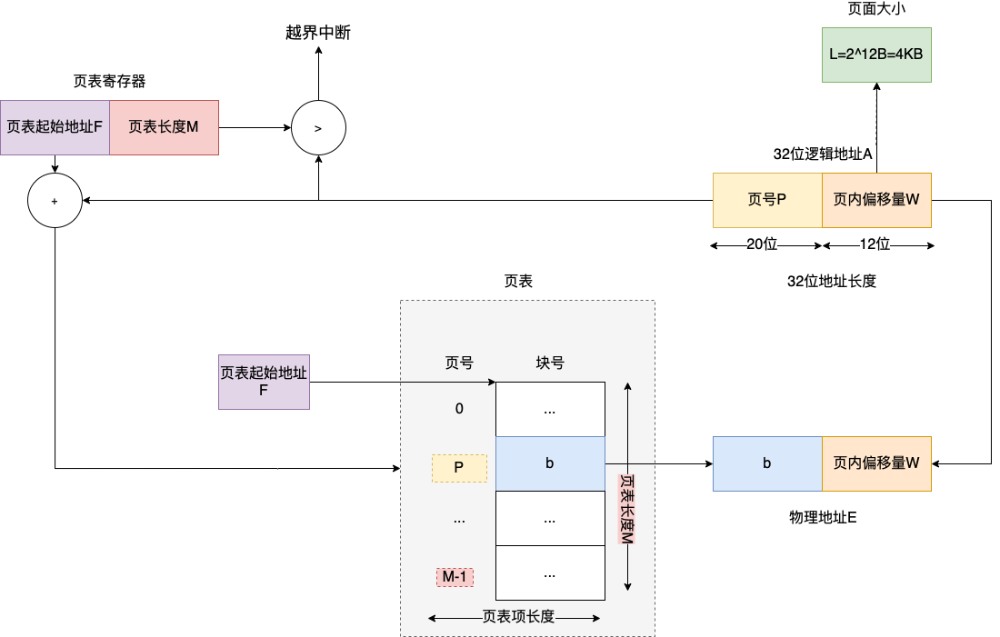
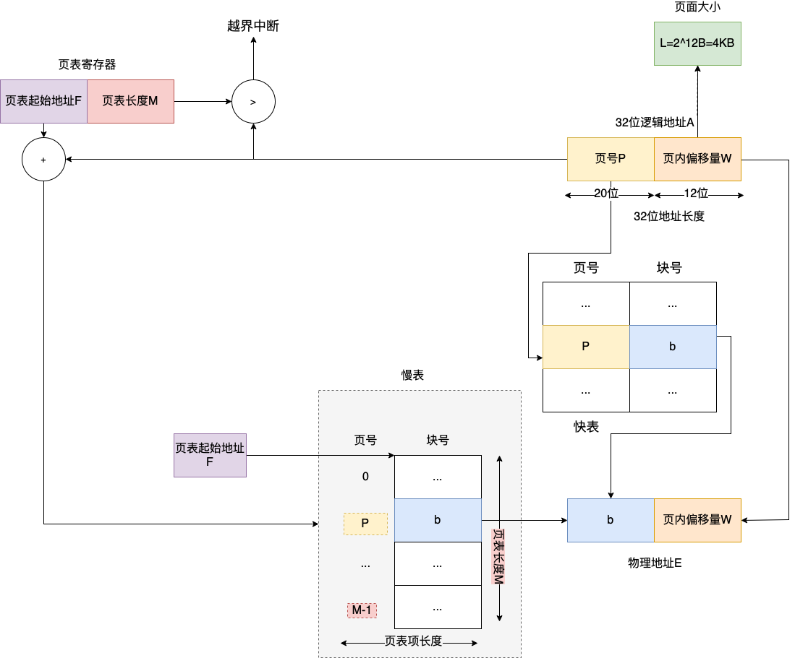
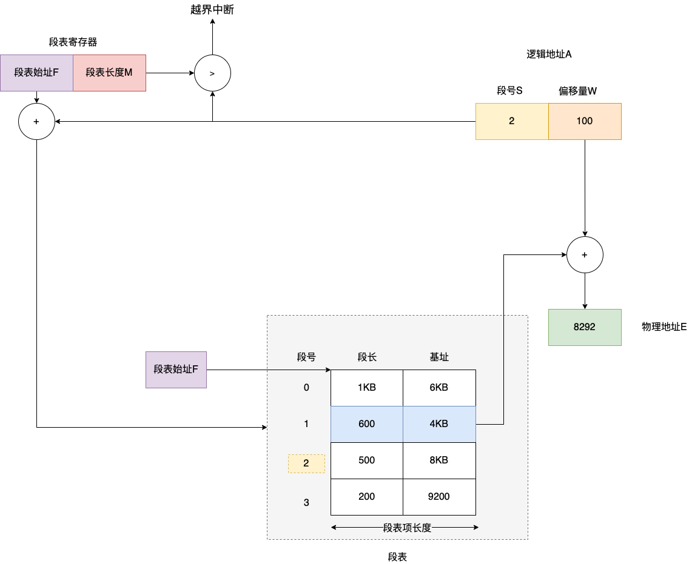
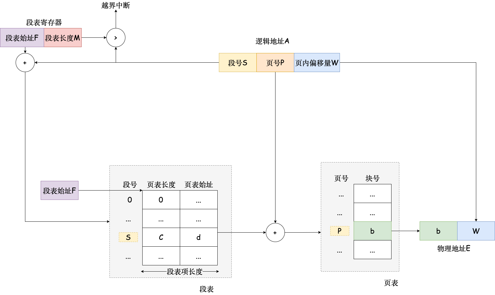

# 3.1 内存管理概念
## 3.1.1 内存管理的基本原理和要求
主要功能：

- 内存空间的分配与回收
- 地址转换
- 内存空间的扩充
- 内存共享
- 地址保护
#### 1.程序的链接和装入
将程序变为可在内存中执行的程序步骤

1. 编译
1. 链接
1. 装入

链接方式
（1）静态链接

（2）装入时动态链接

（3）运行时动态链接

装入方式

（1）绝对装入

产生绝对地址装入

（2）可重定位装入

起始位置 +100

（3）动态运行时装入

起始位置+x
#### 4.内存保护
（1）设置一对上、下限寄存器

（2）采用重定位寄存器和界地址寄存器

界地址寄存器是最大逻辑地址

重定位寄存器是最小逻辑地址

逻辑地址<界地址寄存器，逻辑地址 + 重定位寄存器=物理地址
## 3.1.3 连续分配管理方式
### 1.单一连续分配
| 系统区 |
| ------ |
| 用户区 |

只有一道程序在用户区
### 2.固定分区分配
房子已经砌好了，每个分区装入一道作业
### 3.动态分区分配
从空地里起房子。

每个分区大小正适合进程需要

每个进程就是一个分区，但是换进换出会产生许多外部碎片。

又一个空闲分区链

首次适应算法：从地址底到高分配

邻近适应算法：首次适应算法，但是每次从上次查找结束的位置开始找。

最佳适应算法：总把最小的分配出去

最坏适应算法：总把最大的分配出去
## 3.1.4 基本分页存储管理
### 1.分页存储的几个概念
按块申请空间，这个块比固定分区分配的分区要小很多，平均每个页产生半个块的页内碎片。

（3）页表

一个进程对应一张页表

页表=（页号，块号），因为页号是连续存放的，所以不占字节，块号由映射到的物理空间大小决定
怎样把逻辑地址变成物理地址？

已知页面大小 L=1KB，页号 2 对应的物理块为 8，计算逻辑地址 A=2500 的物理地址 E？
::: tip 解
页面大小 1KB，说明页内偏移量为 10 位，因为 1KB=2^10B
页号=2500/1K=2,
页内偏移=2500%1K=452,
已知页号 2 对应物理块号 8，所以物理地址为 8x1K+452=8644
:::

分页存储地址变换机构
以上过程 2 次访存，1 是取块号，2 是根据物理地址取指令。
### 2. 基本地址变换机构
基本地址变换机构利用页表将逻辑地址转换为内存中的物理地址。

1.逻辑地址 A 可以用（页号，页内偏移量）表示，页号 x 页表项长度 + 页内偏移量=逻辑地址 A

2.用页号找到页表里的块号。块号的地址（页表项地址）=页表始址 + 页号 Px 页面大小 L

3.物理地址=块号 x 页面大小 L+页内偏移量
### 3.具有快表的地址变换机构
加入快表，快表是高速缓冲存储器，如果通过快表查询块号则减少了一次访存。以下可能需要 2 次访存或 1 次访存。

添加快表的分页存储地址变换机构

查找成功，一次访存

查找失败，两次访存

查快表不算访存。
### 4.两级页表
## 3.1.5 基本分段存储管理

分段系统的地址变换过程
2 次访存。
## 3.1.6 段页式管理

逻辑地址用段号去换了个页号地址，拿着页号地址换了个块号。变成了物理地址。

段页式系统的地址变换机构
一共 3 次访存

